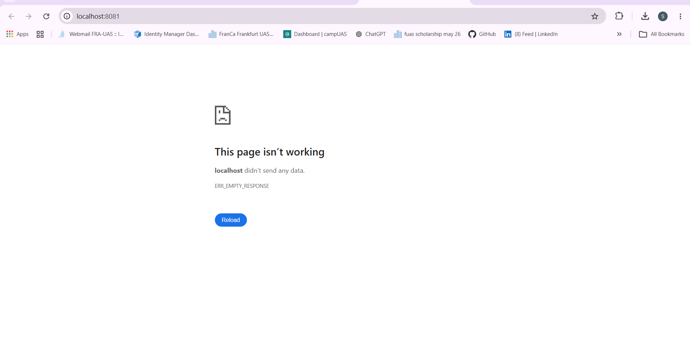

# PostgreSQL Failure Handling – Result Service

## Reproduction

The application was started using Docker Compose:

```bash
docker compose up -d --build db redis worker vote result
```

A vote was submitted at `http://localhost:8080`, and non-zero results were confirmed at `http://localhost:8081`.

PostgreSQL was then stopped without stopping the Result service:

```bash
docker compose stop db
```

Before the change, the Result service crashed because the PostgreSQL client's connection error was not handled. The browser returned `ERR_EMPTY_RESPONSE`, and the logs showed an `Unhandled 'error' event`.


## Finding

The root cause was an unhandled PostgreSQL client connection error in the Result service.

When the established database connection was terminated, the `pg` client emitted an error that caused the Node.js process to terminate.

The application also had no clear user-facing state to indicate that results were unavailable.

## Change Implemented

The Result service was changed to handle PostgreSQL connection and query failures explicitly.

The implementation:

- Tracks database availability.
- Handles PostgreSQL client connection errors.
- Logs database failures for operators.
- Notifies connected clients when the database becomes unavailable.
- Stops the polling loop when the database connection is no longer usable.

The frontend was changed to display:

```text
Results currently unavailable
```


and hide previously received vote scores while the database is unavailable.

## Verification

The healthy state was verified with PostgreSQL running. The Result service logged:

```text
App running on port 80
Connected to db
```

The database failure was then reproduced using:

```bash
docker compose stop db
```

The observed detection time was approximately **2 seconds**.

After the change:

- The Result container remained running.
- The Node.js process did not crash.
- The browser displayed `Results currently unavailable`.
- Database connection/query errors were recorded in the Result service logs.
- No `Unhandled 'error' event` was observed.
- Previously received scores were not displayed as current results.

Example failure logs:

```text
Database connection error: terminating connection due to administrator command
Database connection error: Connection terminated unexpectedly
Error performing query: Error: Client has encountered a connection error and is not queryable
```

## Regression Verification

The repository does not contain a JavaScript unit-test framework for the Result service. The existing `result/tests/tests.sh` test covers successful vote processing and does not cover PostgreSQL connection loss.

Therefore, the database failure behavior was verified using the repeatable manual procedure below:

1. Start the application.
2. Confirm PostgreSQL is healthy and the Result service connects.
3. Confirm normal vote results are displayed.
4. Stop only PostgreSQL.
5. Confirm the Result service remains running.
6. Confirm `Results currently unavailable` is displayed.
7. Confirm the database failure is present in the service logs.

## Expected Behavior

When PostgreSQL is available, the Result service displays the current vote results normally.

When PostgreSQL becomes unavailable, the Result service remains running, reports the database failure in its logs, and shows:

```text
Results currently unavailable
```

The application must not present previously received results as current while the database is unavailable.

Automatic database reconnection was not implemented because it is outside the scope of this focused change.
